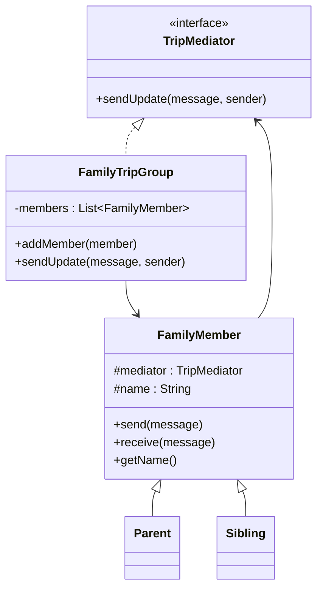

# Mediator Pattern in This Example

This example uses the Mediator pattern for a familiar human situation:

- planning a family trip in a group

When several family members need to coordinate, direct person-to-person communication quickly becomes messy. One person tells another, then that person tells someone else, and updates get missed.

The Mediator pattern avoids that by giving everyone a common middle point for communication.

## Classes and their roles

- `TripMediator`
  - This is the mediator interface.
  - It defines:
    - `sendUpdate(String message, FamilyMember sender)`

- `FamilyTripGroup`
  - This is the concrete mediator.
  - It keeps track of all family members.
  - When one member sends a message, it forwards that update to the others.

- `FamilyMember`
  - This is the colleague base class.
  - Every member knows the mediator.
  - It sends messages through the mediator instead of contacting others directly.

- `Parent` and `Sibling`
  - These are concrete colleague classes.
  - They inherit the common communication behavior from `FamilyMember`.

## How it works step by step

In `Main`, we create one mediator:

```java
FamilyTripGroup familyTripGroup = new FamilyTripGroup();
```

Then we create members like:

```java
FamilyMember mother = new Parent(familyTripGroup, "Mother");
FamilyMember sister = new Sibling(familyTripGroup, "Sister");
```

Each member gets the same mediator reference.

Then the members are registered with the mediator:

```java
familyTripGroup.addMember(mother);
familyTripGroup.addMember(sister);
```

Now suppose this happens:

```java
mother.send("Train tickets are booked for Saturday morning.");
```

This does not directly call `sister.receive(...)` or `father.receive(...)`.

Instead:

1. `mother.send(...)` calls the mediator.
2. `FamilyTripGroup.sendUpdate(...)` loops through all members.
3. Everyone except the sender receives the message.

That logic is here:

```java
for (FamilyMember member : members) {
    if (member != sender) {
        member.receive(sender.getName() + ": " + message);
    }
}
```

## Why this is Mediator

The key idea is:

- family members do not communicate with each other directly
- they communicate through the mediator

So instead of every member needing references to every other member, each member only knows the mediator.

## Why this is useful

Without Mediator, communication becomes tightly coupled:

- mother may need direct access to father, sister, and brother
- sister may need access to everyone too
- adding a new member makes the communication graph more complex

With Mediator:

- each member talks to one central coordinator
- communication logic stays in one place
- adding more members is easier

## Why this example feels practical

Families, roommates, and friend groups often coordinate around:

- trips
- events
- dinners
- chores

In real life, people often prefer a central chat or coordinator rather than everyone managing separate private conversations. That is exactly the kind of situation the Mediator pattern models well.

## Class Diagram


