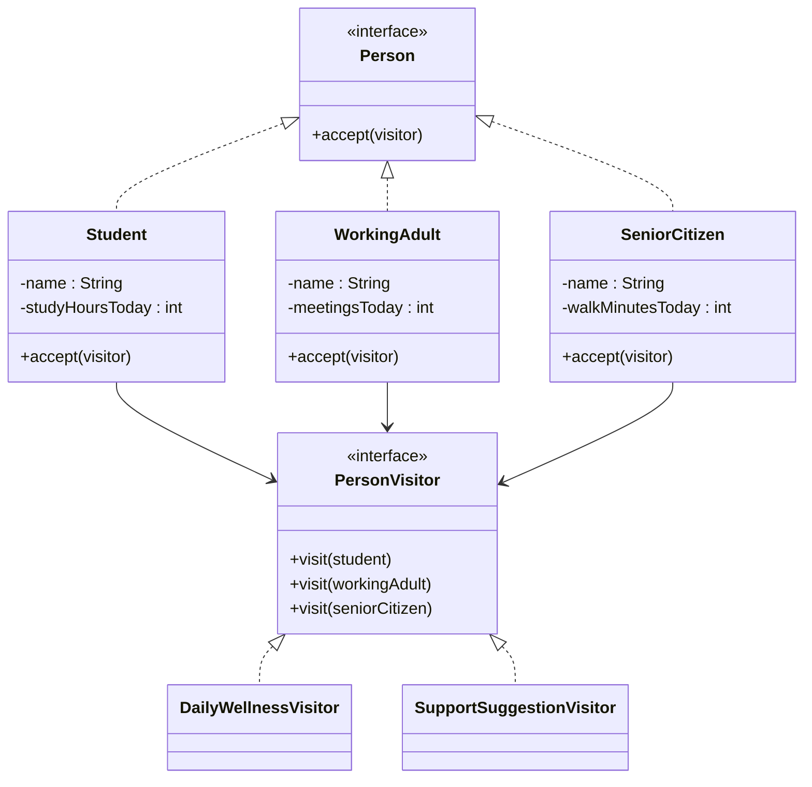

# Visitor Pattern in This Example

This example uses the Visitor pattern for a human-centered scenario:

- checking the daily wellness of different family members

The family has different kinds of people:

- a student
- a working adult
- a senior citizen

Each type has different data, but we may want to run different operations on all of them, such as:

- printing a daily summary
- giving support suggestions

Instead of placing every operation inside each person class, the Visitor pattern moves those operations into separate visitor classes.

## Classes and their roles

- `Person`
  - This is the element interface.
  - It defines:
    - `accept(PersonVisitor visitor)`

- `Student`, `WorkingAdult`, `SeniorCitizen`
  - These are concrete elements.
  - Each one has its own data.
  - Each one accepts a visitor.

- `PersonVisitor`
  - This is the visitor interface.
  - It defines overloaded methods for each concrete element type.

- `DailyWellnessVisitor`
  - Prints a summary for each type of family member.

- `SupportSuggestionVisitor`
  - Gives a custom suggestion for each type.

## How it works step by step

In `Main`, we create different kinds of people:

```java
Person[] familyMembers = {
    new Student("Anaya", 3),
    new WorkingAdult("Rohit", 7),
    new SeniorCitizen("Dadi", 25)
};
```

Then we create visitors:

```java
PersonVisitor wellnessVisitor = new DailyWellnessVisitor();
PersonVisitor supportSuggestionVisitor = new SupportSuggestionVisitor();
```

Now when this runs:

```java
familyMember.accept(wellnessVisitor);
```

the actual object decides which `visit(...)` method should be called.

For example:

- `Student.accept(visitor)` calls `visitor.visit(this)`
- `WorkingAdult.accept(visitor)` calls `visitor.visit(this)`
- `SeniorCitizen.accept(visitor)` calls `visitor.visit(this)`

That is what allows different behavior for different element types.

## Why this is Visitor

The key idea is:

- the data structure stays the same
- new operations can be added by creating new visitors

We did exactly that here:

- one visitor for reporting
- one visitor for suggestions

No existing person classes had to be changed to add those two operations.

## Why this is useful

Without Visitor, each class might need methods like:

- `printSummary()`
- `giveSuggestion()`
- `generateHealthNote()`

Over time, person classes become crowded with unrelated operations.

With Visitor:

- element classes stay focused on their own data
- behavior is added in visitor classes
- new operations are easier to introduce

## Why this example feels practical

Families often look at the same people in different ways:

- daily progress
- support needs
- health reminders
- schedule planning

The people do not change, but the operation changes.
That is a natural fit for Visitor.

## Class Diagram


