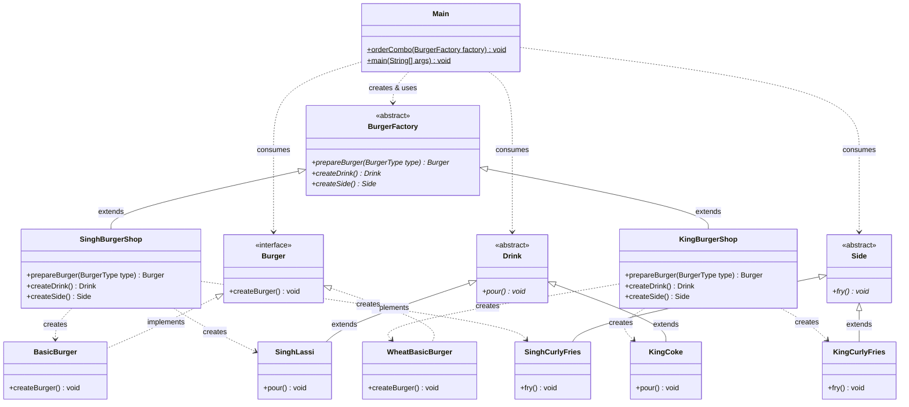

# 🍔 Burger Shop: Abstract Factory Pattern Analysis & Guide

This document analyzes the implementation in `DesignPatterns/creational/abstract_factory`, explains **what pattern was actually created**, **what is missing to make it a true Abstract Factory**, and provides **the code without any pattern** for comparison.

---

## 📌 Executive Summary: What Did You Actually Create?

> [!IMPORTANT]
> **Key Finding:** The current code in this folder implements the **Factory Method Pattern** (parameterized), **NOT** the **Abstract Factory Pattern**.

### Why?
Look at the distinction:
- **Factory Method:** Focuses on creating **one product type** (`Burger`) by delegating the instantiation to subclasses (`SinghBurgerShop`, `KingBurgerShop`).
- **Abstract Factory:** Focuses on creating **families of related or dependent products** (e.g., `Burger` + `Drink` + `Fries` or `Bun` + `Patty` + `Sauce`).

In your codebase, `BurgerFactory` produces **only** `Burger`:
```java
public abstract class BurgerFactory {
    public abstract Burger prepareBurger(BurgerType type); // Only one product interface!
}
```
Because there is only one product type hierarchy (`Burger`), there is no **product family**. Therefore, this is a **Factory Method**.

---

## 🔍 What Are You Missing? (Detailed Review)

### 1. Missing Families of Related Products (The Core Miss)
The entire purpose of the Abstract Factory pattern is to ensure that products from the same family are used together without mixing incompatible variants.

- **Current code:** Only creates `Burger`.
- **True Abstract Factory:** Should create a family, for example:
  - Fast-Food Meal Family: `Burger` + `Drink` + `Fries`
  - Or Ingredient Family: `Bun` + `Patty` + `Sauce`

If you only have `Burger`, you do not need Abstract Factory; Factory Method is sufficient.

---

### 2. Simple Factory `if-else` Embedded Inside Subclasses
In `SinghBurgerShop.java` and `KingBurgerShop.java`:
```java
if (type == BurgerType.BASIC) {
    return new BasicBurger();
} else if (type == BurgerType.STANDARD) {
    return new StandardBurger();
} else if (type == BurgerType.PREMIUM) {
    return new PremiumBurger();
}
```
- This introduces a conditional type switch inside each factory subclass.
- **Violation of Open-Closed Principle (OCP):** If you add a `DELUXE` burger, you must modify `BurgerType` enum and edit `if-else` blocks across all concrete shops.
- In a classic Abstract Factory, each distinct product in the family has its own factory method (`createBurger()`, `createDrink()`, `createSide()`).

---

### 3. Client Usage in `Main.java` Ignores Returned Products
In `Main.java`:
```java
singhFactory.prepareBurger(BurgerType.BASIC);
```
- The method returns a `Burger`, but the returned reference is never stored or acted upon.
- `createBurger()` on `Burger` is never called, so nothing is executed or printed.

---

### 4. Semantic Modeling in `Burger.java`
```java
public interface Burger {
    public void createBurger();
}
```
- A burger object shouldn't "create" itself; the factory creates the burger!
- A better interface method on `Burger` would be domain actions like `prepare()`, `serve()`, `display()`, or `getCost()`.

---

### 5. Typo in Error Handling
In `KingBurgerShop.java`:
```java
throw new IllegalArgumentException("Burger Type not suppoerted: " + type); // "suppoerted" -> "supported"
```

---

## ❌ How the Code Would Look WITHOUT the Pattern

Without any Factory or Abstract Factory pattern, the client code (e.g., `Main` or `OrderService`) directly instantiates concrete classes using the `new` keyword and handles all conditional logic itself.

### Code Without Pattern:

```java
package DesignPatterns.creational.abstract_factory;

import DesignPatterns.creational.abstract_factory.KingBurger.WheatBasicBurger;
import DesignPatterns.creational.abstract_factory.KingBurger.WheatPremiumBurger;
import DesignPatterns.creational.abstract_factory.KingBurger.WheatStandardBurger;
import DesignPatterns.creational.abstract_factory.SinghBurger.BasicBurger;
import DesignPatterns.creational.abstract_factory.SinghBurger.PremiumBurger;
import DesignPatterns.creational.abstract_factory.SinghBurger.StandardBurger;

public class WithoutPatternClient {

    public static void main(String[] args) {
        // Client wants to order burgers from different shops:
        Burger burger1 = orderBurger("SINGH", "BASIC");
        burger1.createBurger();

        Burger burger2 = orderBurger("KING", "PREMIUM");
        burger2.createBurger();
    }

    // ❌ Client is tightly coupled to every single concrete burger class
    // ❌ Huge nested if-else violates Open-Closed Principle (OCP)
    // ❌ Business logic is mixed directly with object construction logic
    public static Burger orderBurger(String shopBrand, String burgerType) {
        Burger burger = null;

        if ("SINGH".equalsIgnoreCase(shopBrand)) {
            if ("BASIC".equalsIgnoreCase(burgerType)) {
                burger = new BasicBurger();
            } else if ("STANDARD".equalsIgnoreCase(burgerType)) {
                burger = new StandardBurger();
            } else if ("PREMIUM".equalsIgnoreCase(burgerType)) {
                burger = new PremiumBurger();
            } else {
                throw new IllegalArgumentException("Unknown burger type: " + burgerType);
            }
        } else if ("KING".equalsIgnoreCase(shopBrand)) {
            if ("BASIC".equalsIgnoreCase(burgerType)) {
                burger = new WheatBasicBurger();
            } else if ("STANDARD".equalsIgnoreCase(burgerType)) {
                burger = new WheatStandardBurger();
            } else if ("PREMIUM".equalsIgnoreCase(burgerType)) {
                burger = new WheatPremiumBurger();
            } else {
                throw new IllegalArgumentException("Unknown burger type: " + burgerType);
            }
        } else {
            throw new IllegalArgumentException("Unknown shop brand: " + shopBrand);
        }

        return burger;
    }
}
```

### The Inconsistency Disaster When Families of Products Are Involved:

Suppose an order consists of a **Burger**, a **Drink**, and a **Side**:
Without an Abstract Factory, the client manually constructs each item:

```java
// ❌ Disaster: Accidental mixing of incompatible families!
Burger burger = new WheatBasicBurger(); // King Burger brand
Drink drink = new SinghLassi();         // Singh Burger brand (oops! Mixed brands!)
Side side = new SinghMasalaFries();     // Singh Burger brand
```
There is no compile-time or design constraint preventing the client from mixing brand products together!

---

## ✅ How It Looks With a TRUE Abstract Factory Pattern

To convert your code into a genuine **Abstract Factory**, introduce a **family of related products**:
1. `Burger`
2. `Drink`
3. `Side`

### 1. Abstract Products
```java
public interface Burger { void prepare(); }
public interface Drink { void pour(); }
public interface Side { void fry(); }
```

### 2. Concrete Product Families

#### Singh Burger Family (Punjabi Street Style)
```java
public class SinghBurger implements Burger {
    public void prepare() { System.out.println("Preparing Spiced Aloo Tikki Burger"); }
}
public class SinghLassi implements Drink {
    public void pour() { System.out.println("Pouring Sweet Punjabi Lassi"); }
}
public class SinghMasalaFries implements Side {
    public void fry() { System.out.println("Frying Peri-Peri Masala Fries"); }
}
```

#### King Burger Family (Wheat & Healthy American Style)
```java
public class WheatBurger implements Burger {
    public void prepare() { System.out.println("Preparing 100% Whole Wheat Whopper"); }
}
public class KingCoke implements Drink {
    public void pour() { System.out.println("Dispensing Chilled Diet Coke"); }
}
public class KingCurlyFries implements Side {
    public void fry() { System.out.println("Frying Classic Curly Fries"); }
}
```

### 3. The Abstract Factory Interface
```java
// Encapsulates the creation of a FAMILY of related products
public interface MealFactory {
    Burger createBurger();
    Drink createDrink();
    Side createSide();
}
```

### 4. Concrete Factories
```java
public class SinghMealFactory implements MealFactory {
    public Burger createBurger() { return new SinghBurger(); }
    public Drink createDrink() { return new SinghLassi(); }
    public Side createSide() { return new SinghMasalaFries(); }
}

public class KingMealFactory implements MealFactory {
    public Burger createBurger() { return new WheatBurger(); }
    public Drink createDrink() { return new KingCoke(); }
    public Side createSide() { return new KingCurlyFries(); }
}
```

### 5. Client Code (Decoupled & Consistent)
```java
public class MealOrderService {
    private final Burger burger;
    private final Drink drink;
    private final Side side;

    // Client depends ONLY on the Abstract Factory interface!
    public MealOrderService(MealFactory factory) {
        this.burger = factory.createBurger();
        this.drink = factory.createDrink();
        this.side = factory.createSide();
    }

    public void serveMeal() {
        burger.prepare();
        drink.pour();
        side.fry();
        System.out.println("Meal served successfully!\n");
    }
}
```

### 6. Main Execution
```java
public class Main {
    public static void main(String[] args) {
        // Order complete Singh Meal - guaranteed no mixed brands!
        MealFactory singhFactory = new SinghMealFactory();
        MealOrderService singhOrder = new MealOrderService(singhFactory);
        singhOrder.serveMeal();

        // Order complete King Meal
        MealFactory kingFactory = new KingMealFactory();
        MealOrderService kingOrder = new MealOrderService(kingFactory);
        kingOrder.serveMeal();
    }
}
```

---

## 📊 Comparison Matrix

| Feature | Without Pattern | Factory Method (Your Current Code) | Abstract Factory (True Pattern) |
| :--- | :--- | :--- | :--- |
| **Products Created** | Any class directly via `new` | **Single product** (`Burger`) | **Family of related products** (`Burger` + `Drink` + `Side`) |
| **Coupling** | Client tightly coupled to all 6+ concrete classes | Client coupled only to `BurgerFactory` & `Burger` | Client coupled only to `MealFactory` & abstract product interfaces |
| **Creation Mechanism** | Nested `if-else` / `switch` in client | Class inheritance (subclasses override factory method) | Object composition (client delegates to a factory instance) |
| **Family Consistency** | ❌ None (can accidentally mix King burger with Singh drink) | N/A (only 1 product) | ✅ Guaranteed (Factory ensures products belong to same brand/theme) |
| **Adding New Brand** | Modify `if-else` in client code (Breaks OCP) | Add new shop subclass (Extends `BurgerFactory`) | Add new factory class (Implements `MealFactory`) without touching existing code |

---

## 📐 UML Class Diagram



